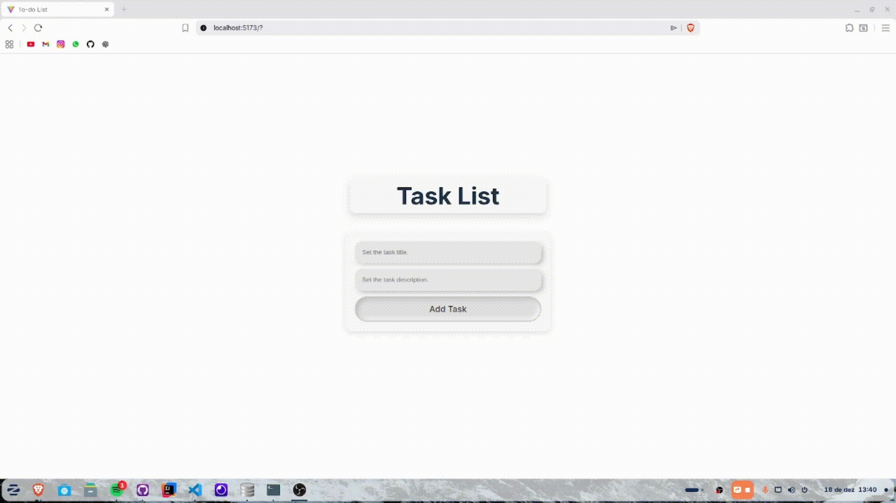

# TodoList-FullStack

> Fullstack Todo List project with an API, allowing users to create tasks with title and description, list, and delete tasks easily.

### 🔧 Adjustments and improvements

~~The project is still under development, and the next updates will focus on the following tasks:~~

- [x] Frontend
- [x] Backend

## 🧪 Technologies

Here are the technologies used in this project:

* NodeJS;
* ReactJS;
* Express.

## 💻 Prerequisites

Before getting started, make sure you meet the following requirements:
* You installed the latest version of `NodeJS`;
* You have a `<Windows / Linux / Mac>` machine.

## 🚀 Installing TodoList-FullStack

To install TodoList-FullStack, follow these steps:

* Click on `Code`;
* Click on `Download ZIP`;
* Extract the project.

## ☕ Using TodoList-FullStack

To use TodoList-FullStack, follow these steps:

* Open a terminal and `cd frontend`;
* Type the command `npm install`;
* Open another terminal for backend and `cd backend`;
* Run `npm install`;
* Start the API on the backend terminal with `node .`;
* Start the frontend with `npm run dev`;
* Open the localhost link that appears in the frontend terminal.

## 📫 Contributing to TodoList-FullStack
To contribute to TodoList-FullStack, follow these steps:

1. Fortk this repository;
2. Create a branch: `git checkout -b <branch_name>`;
3. Make your changes and commit them: `git commit -m '<commit_message>'`;
4. Push to the original branch: `git push origin TodoList-FullStack / <local>`;
5. Create a pull request.

Alternatively, refer to GitHub’s documentation on [how to create a pull request](https://help.github.com/en/github/collaborating-with-issues-and-pull-requests/creating-a-pull-request).

## 🤝 Contributors

We thank the following people who contributed to this project:

<table>
  <tr>
    <td align="center">
      <a href="#">
         
        
          <b>Gabriel Preti Ferraz</b>
        
      </a>
    </td>
  </tr>
</table>

## 📝 License

This project is under license. See the archive [LICENSE](LICENSE.md) for more details.

[⬆ Back to top](#TodoList-FullStack) 
